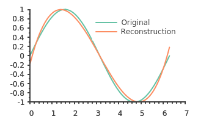

# polyfit
<p align="center">
    
</p>
Polyfit: a command line application to fit a univariate polynomial to arbitrary data. Requires gluplot executable in your path to plot.

Typical use case:  

* `./polyfit -g` (generate some data to fit)
* `./polyfit -o 3 -p -d sin.csv` (fit an order 5 polygon and plot)          

Try increasing the order to improve the fit.

## Getting Started
### Requirements
* GTest (https://github.com/google/googletest) - should download if not found.
* Eigen 3
* sciplot 0.2.0 and a gnuplot executable
* TCLAP

These will be retrieved and set up correctly when you retrieve the library with:
```````
git clone --recurse-submodules <repo>
```````

### Installation
```````
mkdir build
cd build
cmake ..
make -j
```````
Only tested on Ubuntu 20.04.

## Options
No options!

## Resources
### Articles, Tutorials, etc
* https://google.github.io/googletest/primer.html
* https://gist.github.com/mawenbao/9223908

### Support

### Contributing and Contact


